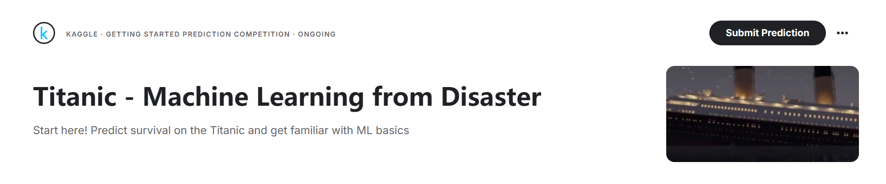
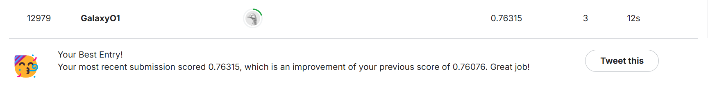
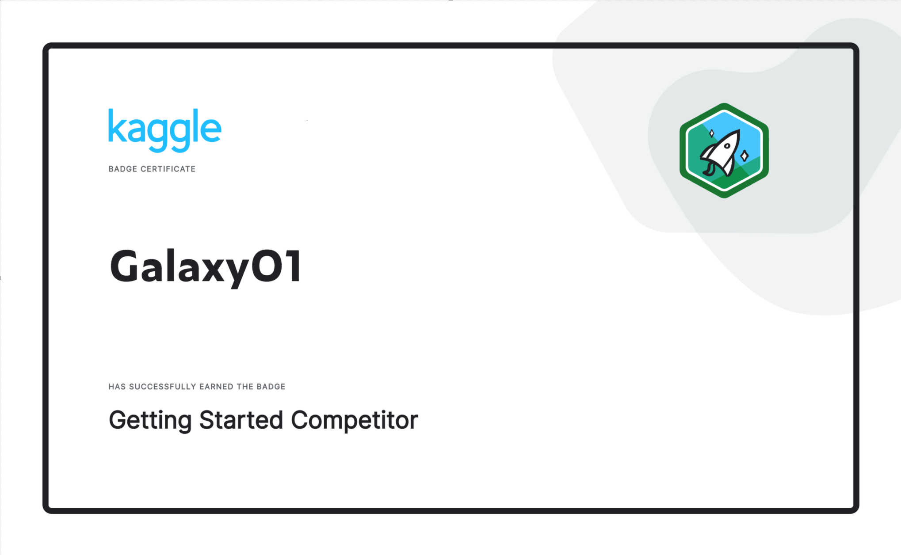

# 泰坦尼克号-灾难中的机器学习
**（仅用逻辑回归，0.76315 score）**

## 🎯项目描述

此项目为 [kaggle](https://www.kaggle.com/) 公开比赛，只是一个机器学习经典入门比赛，没有时间限制，没有比赛规则，参赛者只需上传一份规定格式的 csv 文件用于评判分数即可。（这也是比赛排名中有 1.0 score 的原因）

## 🔢项目步骤

1. 理解数据集
2. **数据预处理**（最难）
3. 模型构建与评估
4. 模型优化
5. 预测并提交结果
6. 总结学习

>在此过程中，本人也查阅过一些资料并询问过AI等工具：
>（本人保证没有一行代码是AI生成）
>1. [#头衔含义解释#](https://yuewen.cn/share/215422361939431424?utm_source=share&utm_content=web_linkcopy&version=2)
>2. [#姓氏推断国籍#](https://yuewen.cn/share/215422851687354368?utm_source=share&utm_content=web_linkcopy&version=2)
>3. [#年龄分层#](https://www.quark.cn/s?from=kkframenew_resultsearch&uc_param_str=ntnwvepffrbiprsvchutosstxs&by=submit&q=%E5%B9%B4%E9%BE%84%E5%88%86%E5%B1%82&queryId=1twcN8jL0881fPoVceSIGIPf8Yv2bcK6YF9YVF7FvjDPpdqC4UMajfaD1b32b4929c2)

## 项目展示

（具体展示请参考 **Jupyter** 文件）

请问大家对泰坦尼克号有过哪些了解呢？

1. 你是否看过电影[《泰坦尼克号》](https://movie.douban.com/subject/1292722/)呢?（作者没看过🙃）
2. 你是否想要知道剧中的男女主角在真实世界是否生存呢？
3. 你想要了解当时社会的阶级现状吗？
4. 你想要了解在危机时刻人性的光明与黑暗吗？

***这些在学习过程中都很有意思，不是吗？***

如果你也对这些感兴趣，那么不妨也自己动手做一下，来探究这些有趣的问题。

## ❤️‍🔥总结学习

---

**首先**，从结果可以看出，训练到测试准确率是降低的，训练可能存在 **过拟合** (clf3 实际上竟然相较于 clf4 更好)。

---

在这个做项目的过程中，数据是需要 **填充的**、**处理的**、**组合的** 和 **分组分析的**，每一个不同的选择最终都可能出现不同的训练结果。

而且，在数据处理的过程中，也会有很多 **有趣的发现**，如：

1. 当时人们的称谓所代表的阶级
2. 上层社会的主仆关系
3. 不同地区的贫富差距
4. 三等票所代表的底层人的悲哀
5. 家庭成员众多，但在生存问题上的人性自私
6. 性别与年龄在生存问题上的人性光辉

***当然，2 人的家庭生存率最高，这可能就是爱情吧！***

---

总结的时候又突然有了点想法，就留给大家吧：

1. 训练集与测试集在数据预处理时是否应该放在一起处理，比如各称谓的平均年龄填充等。
2. 称谓是否也可以作为一个特征值？
3. 票号是否可以转换为位置特征？
4. 费用 ( Fare | Single_Fare ) 的分层是否过多，只分三层会不会更好？
5. 电影《泰坦尼克号》的男女主是否生存？（作者真没看过）

***这些是否可以提高准确率？***

---

在这次的学习中，**只是简单的运用了逻辑回归**，加上些许的数据预处理的小技巧。

如果说想要提升准确率，提升kaggle分数，那么可能就要需要学习更加高深的分类算法，如：**随机森林** | **决策树** | **神经网络** 等。

---

本人也是拿到了 **Kaggle的入门证书** （不知道有啥用）

---

最后，知识是学无止境的，我也只是学习了些皮毛，通过这个 kaggle 项目进行一次逻辑回归的巩固练习，在未来我一定会有更好的办法去提升这次分数。

---

## ✅其他练习
如果你对此项目不太感兴趣，这里还有两个类似的 kaggle 项目（作者没做过）

1. [信用卡欺诈检测](https://www.kaggle.com/datasets/mlg-ulb/creditcardfraud)
2. [电信客户流失](https://www.kaggle.com/datasets/blastchar/telco-customer-churn)

---

## ✨资源链接

1. [Github]()
2. [GitCode]()
3. Kaggle（未上传，将会持续优化模型）

**感谢大家的观看！**